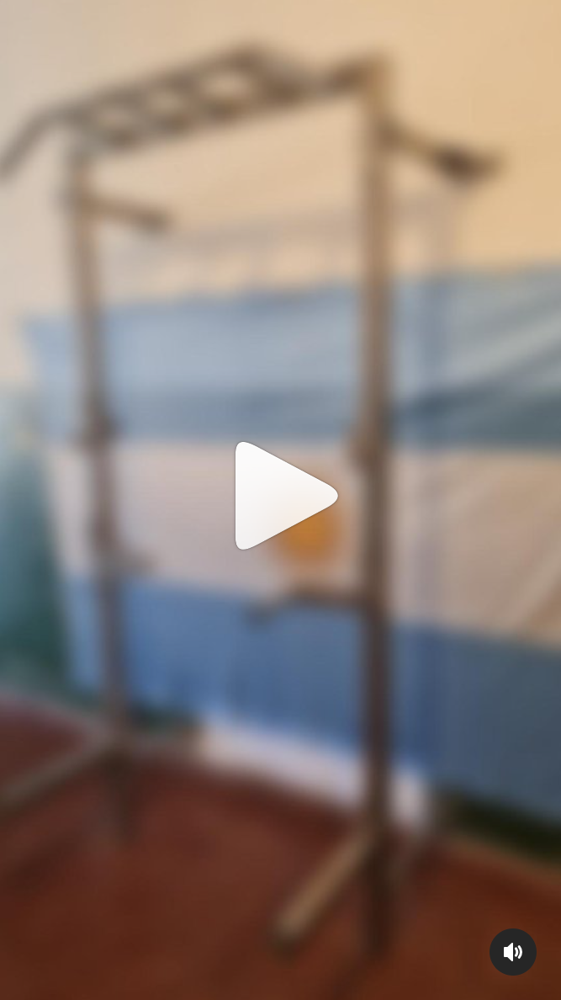

# Proyecto Construcción de Rack Plegable🏗️

> [!NOTE]
> Este repositorio contiene todos los detalles del rack plegable construido, incluyendo planos de diseño, observaciones, imágenes y más. El proyecto abarcó un período total de 28 días, durante los cuales se realizó el diseño inicial, la toma de medidas, la definición y creación de componentes, las pruebas de calidad, el ensamblaje y la instalacion para el usuario final.
> Quotes
 

> 
   

> 
 
.
> `Donde está tu mayor miedo, se encuentra tu mayor crecimiento.`
>
> <a href="https://www.instagram.com/reel/C8SmRuKOeO0/">
>    
> </a>
>
> [!TIP]
> - [Contenido del Proyecto](#contenido-del-proyecto)
> - [Planos](#planos)
> - [Observaciones](#observaciones)
> - [Imágenes](#imágenes)
> - [Autor](#autor)

>[!IMPORTANT]
> ## 📦Contenido del Proyecto
>
> ### 📐 Planos: 
> Los planos del rack están disponibles en la carpeta de: [plans](./plans). Version 1.5
>
> ### 🔍Observaciones: 
>  Las observaciones y notas detalladas se pueden encontrar en la carpeta de [notes](./notes).
se creo una versión simplificada y práctica. 

> [!Warning]
> ### 🖼Imágenes:
>  Las imágenes relacionadas con el proyecto están en la carpeta de[images](./images).

> [!Caution]
> ## 👤Autor
>- **Nombre:** @fabri.lar
>- **Contacto:** fabricioherrera1702atgmail.com
