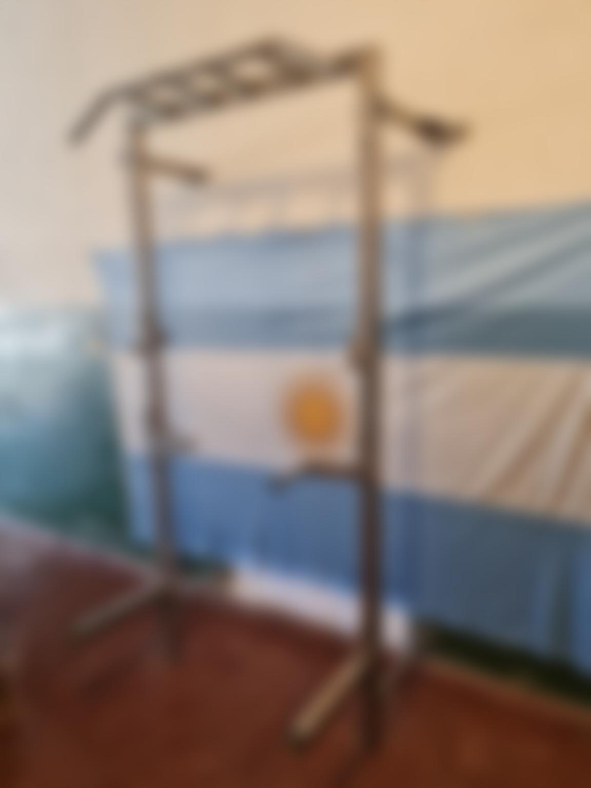

# Proyecto de Construcción de Rack

## Descripción
Este repositorio contiene todos los detalles del rack que he construido, incluyendo planos, observaciones, imágenes y más.

Haz clic en la imagen para ver el video de la construcción del rack.

## Tabla de Contenidos
- [Descripción](#descripción)
- [Contenido del Proyecto](#contenido-del-proyecto)
  - [Planos](#planos)
  - [Observaciones](#observaciones)
  - [Imágenes](#imágenes)
- [Autor](#autor)

## Contenido del Proyecto

### Planos
Los planos del rack están disponibles en la carpeta [plans](./plans).

### Observaciones
Las observaciones y notas detalladas se pueden encontrar en la carpeta [notes](./notes).

### Imágenes
Las imágenes relacionadas con el proyecto están en la carpeta [images](./images).

## Autor
- **Nombre:** Fabricio
- **Contacto:** fabricioherrera1702@gmail.com

